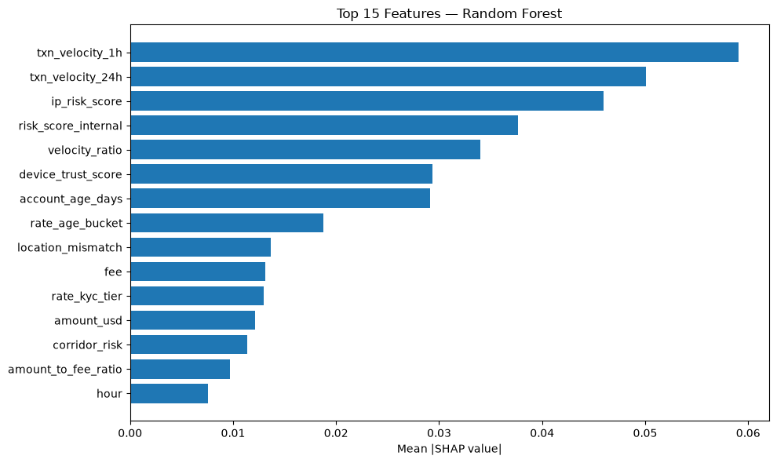
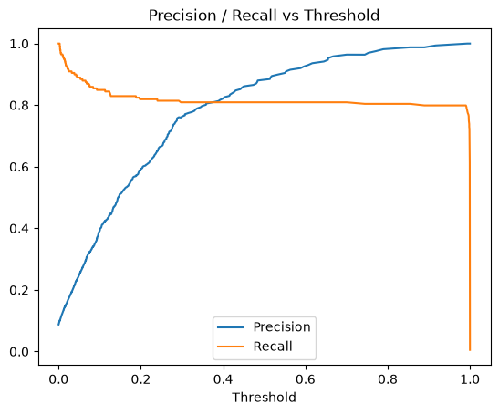

<div align="center">

# 🛡️ NovaPay FraudGuard
### Real-Time Fraud Detection for Digital Payments

--------  

**** 

--------

</div>

---

## 📋 Table of Contents

1. [Overview](#-overview)
2. [Problem Statement](#-problem-statement)
3. [Project Objectives](#-project-objectives)
4. [Dataset & Data Dictionary](#-dataset--data-dictionary)
5. [Project Pipeline](#-project-pipeline)
6. [Data Cleaning & Preprocessing](#-data-cleaning--preprocessing)
7. [Exploratory Data Analysis](#-exploratory-data-analysis)
8. [Feature Engineering](#-feature-engineering)
9. [Modeling Approach](#-modeling-approach)
10. [Handling Class Imbalance](#-handling-class-imbalance)
11. [Threshold Tuning & Decision Policy](#-threshold-tuning--decision-policy)
12. [Model Evaluation & Diagnostics](#-model-evaluation--diagnostics)
13. [Results Summary](#-results-summary)
14. [Key Findings](#-key-findings)
15. [Project Structure](#-project-structure)
16. [Tech Stack](#-tech-stack)

---

## 🔎 Overview

**NovaPay FraudGuard** is a real-time fraud detection system built to improve the safety and reliability of digital financial transactions across web, mobile, and ATM channels. In a payment environment where transactions clear in seconds, suspicious activity has to be identified just as fast, this project was built around that constraint from the start.

Rather than reacting to fraud after money has already moved, NovaPay FraudGuard is designed for **early detection**: it studies how customers normally behave, how activity varies by channel and time of day, and how transaction patterns differ between legitimate and fraudulent behavior, then uses that to flag risky transactions before they complete.

Beyond the technical detection layer, the project also aims to strengthen trust in the platform. When customers know their transactions are monitored intelligently, they use the service with more confidence making this as much a trust and safety investment as a technical one.

--------  
****  
--------

---

## ⚠️ Problem Statement

Fraud remains one of the most serious challenges facing digital payment systems, causing direct monetary losses, higher operational cost, and eroded customer trust. Even a small fraud rate becomes a large absolute problem at scale.

Analysis of the NovaPay transaction dataset (**11,400 records, 26 raw variables**) shows:

- **≈8.8%** of all transactions are fraudulent — a meaningful minority-class problem, not a rounding error
- Fraud is **not evenly distributed** — it concentrates in specific channels (notably web-based transactions), specific hours (early morning), and specific account-age segments
- This non-random structure is exactly what makes a **data-driven detection system** viable if fraud were pure noise, no model could learn it

Manual review alone cannot keep pace with this volume and speed, which is the core motivation for building an automated, statistically grounded detection pipeline.

---

## 🎯 Project Objectives

- **Develop a real-time fraud detection framework** capable of flagging suspicious transactions before financial loss occurs
- **Analyze historical transaction data** to uncover fraud patterns across channel, geography, customer segment, and time
- **Engineer meaningful predictive features** transaction velocity, account age, chargeback history, spending behavior  that give the model real separating signal
- **Perform rigorous EDA** to understand data structure, anomalies, and variable relationships before modeling
- **Run statistical and correlation analysis** to identify the strongest fraud predictors
- **Produce clear visualizations** that communicate fraud patterns to technical and non-technical stakeholders alike
- **Build a clean, leakage-safe analytical dataset** through careful handling of duplicates, missing values, and inconsistent entries
- **Support future model development** with a well-structured, high-quality feature set

---

## 🗂️ Dataset & Data Dictionary

| Column | Description |
|---|---|
| `transaction_id` | Unique identifier for each transaction |
| `customer_id` | Unique identifier for each customer |
| `timestamp` | Date and time the transaction occurred — source of all time-based features |
| `channel` | Platform used: Web, Mobile, ATM, or Unknown |
| `home_country` | Customer's registered country |
| `source_currency` / `dest_currency` | Currency of origin and destination |
| `amount_src` / `amount_usd` | Transaction amount in source currency and USD-normalized |
| `fee` | Transaction fee |
| `ip_address` / `ip_country` / `ip_risk_score` | Network-level identifiers and a pre-computed risk score |
| `device_id` / `device_trust_score` / `new_device` | Device-level identifiers and trust signals |
| `location_mismatch` | Flag for geographic inconsistency between customer and transaction origin |
| `kyc_tier` | Customer's identity-verification tier |
| `account_age_days` | Age of the account in days at the time of the transaction |
| `chargeback_history_count` | Number of prior chargebacks on the account |
| `risk_score_internal` | Pre-computed internal risk score |
| `txn_velocity_1h` / `txn_velocity_24h` | Transaction frequency in the trailing 1-hour / 24-hour window |
| `corridor_risk` | Risk score associated with the source→destination corridor |
| `is_fraud` | **Target variable** — 1 = fraudulent, 0 = legitimate |

### Engineered Time Features

| Feature | Description |
|---|---|
| `hour` | Hour of day (0–23) the transaction occurred |
| `day_name` | Day of week |
| `month` / `year` | Calendar month / year |
| `is_weekend` | Weekend flag |
| `transactions_last_24h` | Count of the same customer's transactions in the trailing 24 hours |

### How to Read a Single Transaction

| Feature | Value |
|---|---|
| Channel | Web |
| Home Country | United States |
| Hour | 15 (3:00 PM) |
| Account Age | 120 days |
| Chargeback History | 2 prior chargebacks |
| Internal Risk Score | 0.78 |
| **Fraud Status** | **1 (Fraud)** |

**Interpretation:** No single field makes this transaction suspicious on its own a Web channel, mid-afternoon transaction, and moderate account age are all individually unremarkable. It's the **combination** an elevated internal risk score *together with* a prior chargeback history that pushes this transaction into fraud territory. This is the core principle behind the entire modeling approach fraud is rarely a single red flag, it's a pattern across several correlated signals.

---

## 🧭 Project Pipeline

--------  
**[ WRITE IMAGE HERE — pipeline flowchart: Raw Data → Cleaning → EDA → Feature Engineering → Train/Test Split → Model Training → Threshold Tuning → Error Analysis → Final Decision Policy ]**  
--------

The project was built as an **iterative, hypothesis-driven pipeline** rather than a single linear script. Each stage's output directly informed the next:

1. **Clean** the raw data (duplicates, missing values, corrupted entries, sentinel values)
2. **Explore** it to find where and how fraud concentrates
3. **Engineer features** grounded in what the EDA actually showed, not guesswork
4. **Train** a baseline model, then iterate with hyperparameter search and rebalancing
5. **Tune the decision threshold** against real business constraints, not a generic metric
6. **Diagnose** exactly which transactions the model still misses, and why
7. **Feed findings back** into targeted feature engineering — repeat until further gains require new data sources, not new modeling

---

## 🧹 Data Cleaning & Preprocessing

Data quality issues were investigated and resolved methodically before any modeling began:

### Duplicate Records
- Checked `transaction_id` for duplication and removed exact duplicate rows
- Verified dataset integrity post-removal

### Missing Values
- Investigated missingness across all numerical, categorical, and datetime columns, with particular attention to `currency`, `fee`, `ip_address`, and `device_trust_score`
- **Numerical columns:** imputed with the **median** (robust to the heavy-tailed distributions common in transaction data mean would be skewed by legitimate large transactions)
- **Categorical columns:** imputed with the **mode**, or labeled `"UNKNOWN"` where that preserved more information than guessing a category
- **Datetime (`timestamp`):** parsed with `errors='coerce'` rather than a strict format, since the raw data contained genuinely corrupted values (e.g. `"2025/13/40 25:61:00"` an impossible month/day/hour/minute combination, not a formatting quirk). Unparseable rows were dropped rather than guessed at, since accurate timing is load-bearing for every time-based feature downstream

### Sentinel / Invalid Values
- Detected and corrected placeholder "invalid" values that don't represent real missingness but were used as data-entry sentinels  e.g. `fee = -1.0` and `device_trust_score = -0.1` were replaced with proper `Fillna` before imputation, rather than being treated as legitimate (and highly distorting) numeric values

### Currency Normalization
- Investigated missing `amount_usd` values by cross-referencing `source_currency` and observed conversion rates
- Applied currency-specific conversion rates to safely backfill recoverable values, and only imputed or dropped values that couldn't be reliably reconstructed

### Negative Amounts
- Identified legitimate negative values (refunds/reversals) versus data errors, and handled each differently rather than blanket-clipping to zero

--------  
****  
--------

---

## 📊 Exploratory Data Analysis

EDA was used to find *where* fraud concentrates every subsequent engineered feature traces back to a pattern found here, not to guesswork.

### Fraud Rate by Time of Day
Fraud is not evenly distributed across the 24-hour cycle — early-morning hours show a materially elevated fraud rate compared to the daily average.

--------  
****  
--------

### Fraud Rate by Channel
Web-based transactions carry a disproportionately higher fraud rate than mobile or ATM channels.

--------  
****   
--------

### Fraud Rate by Account Age
This was one of the strongest signals found in the entire dataset:

| Account Age | Fraud Rate |
|---|---|
| < 30 days | **35.2%** |
| 30–90 days | **43.6%** |
| 91–180 days | 2.6% |
| 181–365 days | 1.7% |
| > 1 year | 1.0% |
| **Overall average** | **8.8%** |

Accounts under 90 days old are **4–5x more likely** to be fraudulent than the dataset average a young account is one of the single clearest fraud indicators available. This finding directly shaped the `age_bucket` and `rate_age_bucket` engineered features (see below).

--------  

****

--------

### Fraud Rate by Chargeback History, Location Mismatch, and New Device
Each of these categorical/binary signals showed a clear, monotonic relationship with fraud likelihood, confirming they belong in the feature set as both raw values and target-encoded rates.

### Correlation Analysis
A correlation heatmap across all numerical variables was used to identify the strongest linear fraud predictors and to check for problematic multicollinearity between engineered and raw features before modeling.

--------  

****  

--------

### Outlier Analysis
IQR-based outlier detection was run across all numeric columns (`amount_usd`, `fee`, `txn_velocity_1h/24h`, `ip_risk_score`, `chargeback_history_count`, `corridor_risk`, and others).

**Important methodological decision:** in a fraud dataset, statistical "outliers" are frequently not noise  they're often *the fraud signal itself*. An unusually high transaction velocity or risk score is exactly what fraud looks like. Blanket outlier removal or capping was deliberately avoided for these columns, since tree-based models (used throughout this project) are already fairly robust to extreme values, and clipping them risks erasing the very extremity that makes fraud detectable. Outliers were investigated and characterized, not stripped by default.

-------- 

****


--------


---

## 🛠️ Feature Engineering

Every engineered feature below was added for a specific, EDA-grounded reason — not speculatively. Where a feature was tested and found not to help, that's documented too, since knowing what *doesn't* work is as valuable as knowing what does.

### Time & Bucket Features
| Feature | Rationale |
|---|---|
| `age_bucket` | 5-bin categorical bucketing of `account_age_days`, directly reflecting the sharp fraud-rate cliff found at the 90-day mark |
| `amount_bucket` | Train-only quantile bucketing of transaction amount, used as an intermediate for target encoding |
| `hour` | Raw hour of day (0–23), retained continuously since the model can already split on it directly |

### Target-Rate (Mean) Encodings — fit on TRAIN only
| Feature | Encodes |
|---|---|
| `rate_age_bucket` | Historical fraud rate for that age bucket |
| `rate_kyc_tier` | Historical fraud rate for that KYC tier |
| `rate_amount_src` | Historical fraud rate for that amount bucket |
| `rate_chargeback` | Historical fraud rate for that chargeback count |

**Leakage discipline:** every rate encoding above is computed using **only the training split's target values**, then mapped onto both train and test, with unseen categories falling back to the training global mean. Computing these on the full dataset (including test rows) — a mistake caught and corrected during development would leak target information into features and produce an artificially inflated evaluation score.

### Interaction & Ratio Features
| Feature | Rationale |
|---|---|
| `velocity_ratio` = `txn_velocity_1h` / `txn_velocity_24h` | Captures bursty short-window activity relative to a day's baseline — a ratio a tree can't reconstruct from separate splits on the two raw columns |
| `amount_to_fee_ratio` | Flags a large transaction pushed through at an anomalously low fee a pattern found specifically in missed fraud cases during error analysis |
| `established_high_velocity`, `established_location_mismatch` | Direct interactions targeting a specific model blind spot (see [Key Findings](#-key-findings)): established accounts that *also* show velocity or location red flags a young account would already be caught on |

### Entity-Linkage Features (device / IP reuse)
| Feature | Rationale |
|---|---|
| `device_shared_accounts` | Count of distinct accounts observed using the same device a classic account-takeover / fraud-ring signal |
| `ip_shared_accounts` | Same concept, for IP address |
| `ip_txn_count` | Transaction volume from a given IP, independent of account |


## 🤖 Modeling Approach

### Preprocessing Pipeline
- Numeric features: median imputation → standard scaling
- Categorical features: constant imputation → encoding (label codes for ordinal-like categories, aligned across train/test to avoid unseen-category errors)
- All ratio-derived features passed through an explicit `inf` sanitization pass before training, since divisions (`amount_to_fee_ratio`, `velocity_ratio`) can produce `inf` on edge-case denominators.

---

****  

---


## ⚖️ Handling Class Imbalance

With fraud at ~8.8% of transactions, class imbalance was addressed at two levels simultaneously:

- **`scale_pos_weight`** (XGBoost) / **`class_weight`** (Random Forest) global multipliers that upweight the entire fraud class uniformly, tuned as part of the hyperparameter search
- **Targeted `sample_weight`** a more surgical intervention that upweights *specifically* the sub-population of fraud cases identified as hardest to detect (established accounts, where age-based signals give no warning), rather than boosting all fraud cases equally

This two-level approach reflects a key finding from the error-analysis stage: fraud in this dataset isn't one homogeneous pattern. Young-account, high-velocity fraud is comparatively easy to separate; established-account fraud is a smaller, harder sub-population that a single global class weight tends to under-serve.

---

## 🎚️ Threshold Tuning & Decision Policy

A single, generic threshold (e.g. 0.5, or "hit 80% recall") was deliberately **not** used as the final decision rule, for a concrete reason found during development: optimizing purely for recall let false positives on legitimate transactions climb from 6 to 11 for barely any fraud-recall gain an unacceptable trade given legitimate-customer experience is a real cost.

### FP-Constrained Threshold Search
Instead, every candidate threshold is scanned directly, filtered to only those keeping **false positives on Legit transactions within an explicit budget**, and among those the one catching the most fraud is selected. This protects the side of the confusion matrix that was already performing well while still maximizing fraud capture within that constraint.

### Three-Tier Decision Policy
Because error analysis showed the remaining missed-fraud cases split into two groups some near-indistinguishable from legit, others with real separating margin the binary threshold couldn't reach without more false positives a three-tier system was adopted instead of one cutoff:

| Tier | Action |
|---|---|
| **Score below lower threshold** | Auto-approve |
| **Score in the middle band** | Route to manual review |
| **Score above upper threshold** | Auto-block |

This is standard practice in production fraud systems for good reason: it recovers value from the "recoverable but ambiguous" cases without touching the auto-block false-positive budget the business is already satisfied with. The width of the review band is a **business decision** (review-team capacity) layered on top of a statistical one.

---

****

---

---

## 🔬 Model Evaluation & Diagnostics

Standard metrics were only the starting point the real diagnostic work happened at the level of *individual missed transactions*, not aggregate scores.

### Standard Metrics
- Classification report (precision / recall / F1 per class)
- Confusion matrix at the FP-constrained threshold
- Precision-Recall curve and PR-AUC (primary metric, appropriate for imbalanced classes)
- ROC curve and ROC-AUC (secondary)

---

****

---


### Feature Importance
Ranked importance was checked after every feature-engineering round specifically to verify whether new features were actually being used by the model several rounds of engineered features (interaction terms, one-hot buckets) ranked at or near **zero importance**, directly confirming they added no real signal before more time was spent on them.

### SHAP Analysis
`TreeExplainer` was used to inspect what the model actually relies on globally, and to break down individual missed-fraud predictions feature-by-feature showing precisely which signals pushed a specific fraud case toward "legit" in the model's eyes.

### Nearest-Neighbor Overlap Check
For every missed-fraud case, its closest legitimate transaction in standardized feature space was identified and measured. This directly tested whether the model was failing due to insufficient training emphasis (fixable by reweighting) or genuine feature-space overlap (not fixable without new data):

- **Median distance, missed fraud → nearest legit: 0.57**
- **Median distance, caught fraud → nearest legit: 7.89**

---

## 📈 Results Summary

| Iteration | Legit TN | Legit FP | Fraud FN | Fraud TP | Notes |
|---|---|---|---|---|---|
| Baseline XGBoost | 2,063 | 6 | 40 | 159 | Initial model, default feature set |
| Recall-target threshold (0.80) | 2,058 | 11 | 39 | 160 | **Rejected** — FP nearly doubled for +1 TP |
| FP-constrained threshold | 2,063 | 6 | 40 | 159 | Restored Legit performance, same fraud recall |
| + Interaction features | 2,063 | 6 | 40 | 159 | No change — features ranked near-zero importance |
| + Sample-weighted established fraud | 2,063 | 6 | 40 | 159 | No change — confirmed a data ceiling, not a weighting problem |
| + Random Forest (class_weight) | 2,063 | 6 | 40 | 159 | **Identical** miss-set to XGBoost — algorithm-independent confirmation |
| + Entity-linkage features (device/IP reuse, kyc_tier_low, corridor_risk) | 2,063 | 6 | **38** | **161** | **First genuine improvement** — new information, not repackaged signal |
| + is_night_transaction | 2,063 | 6 | 39 | 160 | Tested, reverted — net negative |

---

## 💡 Key Findings

1. **Account age is the single strongest fraud predictor**  accounts under 90 days show a 35–44% fraud rate versus an 8.8% baseline, a 4–5x lift.
2. **Transaction velocity dominates model decision-making** — `txn_velocity_1h` and `txn_velocity_24h` combined account for the majority of total feature importance in the tuned model.
3. **Fraud is not one homogeneous pattern.** Two distinct sub-populations emerged from error analysis: fast, high-velocity fraud on young accounts (well-detected), and quieter, established-account fraud that mimics legitimate behavior on every existing signal (the hard cases).
4. **Reweighting.** An aggressive ~31x combined class-weighting intervention on the harder fraud sub-population produced zero change in outcome direct evidence the bottleneck was informational, not about training emphasis.
5. **Entity-linkage features (device/IP reuse across accounts) were the first genuinely new signal source tried**, and the only intervention in the entire iteration history to move the confusion matrix — validating that further gains require new *information*, not more feature transformation of the same columns.
6. **A three-tier decision policy outperforms a single threshold** for this problem: it recovers value from ambiguous, separable cases without compromising the false-positive budget on cases the model is already confident about.

---

## 📁 Project Structure

```
Novapay-fraudulent/
├── data/
│   └── nova_pay_combined.csv          # Raw transaction data
├── notebook/
│   └── EDA.ipynb                      # Full exploratory analysis, cleaning, and iteration history
├── fraud_model_pipeline.py            # Baseline pipeline: cleaning → features → XGBoost → evaluation
├── fraud_model_enriched_pipeline.py   # Enriched pipeline: entity-linkage features, hyperparameter
│                                       # search, FP-constrained threshold tuning, error analysis,
│                                       # Random Forest comparison, SHAP + nearest-neighbor diagnostics
└── README.md                          # This file
```

---


## 🧰 Tech Stack

- **Data manipulation:** pandas, NumPy
- **Visualization:** Matplotlib, Seaborn
- **Modeling:** scikit-learn (XGBoost, RandomForestClassifier, LogisticRegression), CatBoost
- **Model selection:** `RandomizedSearchCV`
- **Interpretability:** SHAP
- **Environment:** Jupyter / VS Code Interactive Window

---

<div align="center">


*Built as part of the NovaPay Fraud Detection project.*

[](https://eliasdatascientist)

[](www.linkedin.com/in/elias-data-scientist)


</div>
